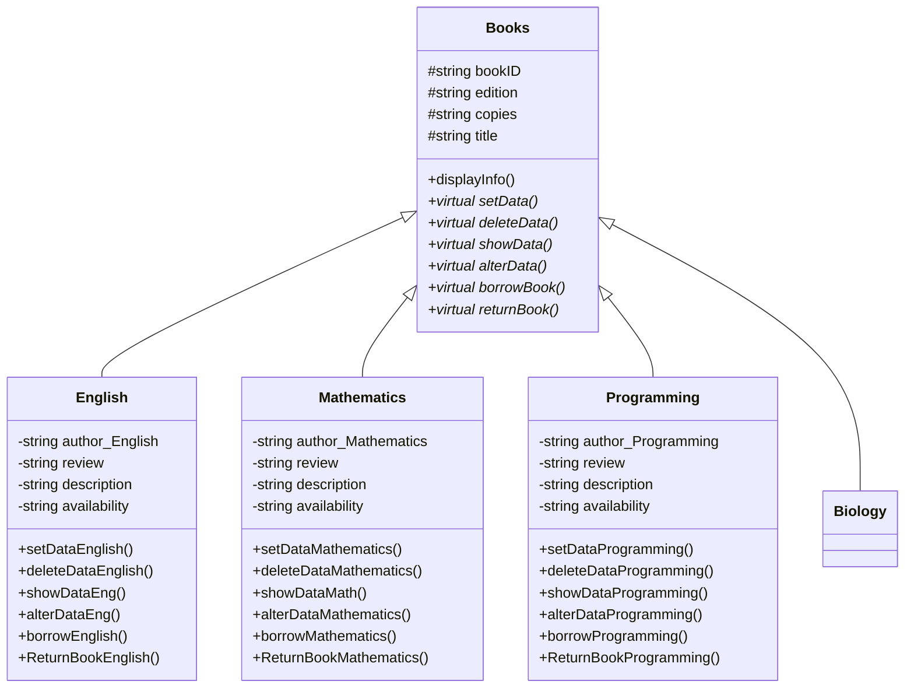
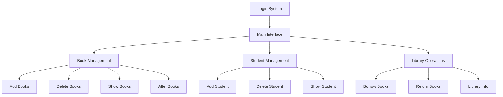

# Library Management System

A comprehensive C++ based Library Management System that implements Object-Oriented Programming principles to manage books, students, and library operations.

## System Architecture

### Class Hierarchy

### System Components

## Features

1. **User Authentication**
   - Login/Signup system
   - Password recovery mechanism
   - Session management

2. **Book Management**
   - Add new books
   - Delete existing books
   - Show book details
   - Modify book information
   - Categorize books (English, Mathematics, Programming, Biology)

3. **Student Management**
   - Add student records
   - Delete student records
   - View student information
   - Track borrowed books

4. **Library Operations**
   - Book borrowing system
   - Book return system
   - Book availability tracking
   - Library information display

## OOP Principles Implementation

### 1. Encapsulation
- Private data members in all classes
- Protected access for inheritance
- Public interfaces for operations
- Getter/Setter methods for data access

### 2. Inheritance
- Base class: `Books`
- Derived classes: `English`, `Mathematics`, `Programming`, `Biology`
- Proper inheritance hierarchy

### 3. Polymorphism
- Runtime polymorphism through virtual functions
- Function overloading for different parameter sets
- Virtual destructors for proper cleanup
- Abstract base class with pure virtual functions

### 4. Abstraction
- Abstract base class `Books`
- High-level interfaces for operations
- Implementation details hidden from users
- Clear separation of concerns

## File Structure

- `Library Management System (Project Source Code).cpp` - Main source code
- `InfoLib.txt` - Library information file
- `logins.txt` - User authentication data
- Book and student data files (created dynamically)

## Data Management

The system uses file handling for persistent storage:
- Each book category has its own file management
- Student records are stored in separate files
- Login information is securely stored
- File operations include:
  - Create
  - Read
  - Update
  - Delete

## Security Features

1. Password Protection
2. File-based authentication
3. Session management
4. Access control
5. Data validation

## User Interface

The system provides a console-based interface with:
1. Clear menu navigation
2. Intuitive options
3. Error handling
4. User feedback
5. Confirmation messages

## Error Handling

The system implements robust error handling for:
1. File operations
2. User input validation
3. Authentication errors
4. Resource management
5. Data consistency

## Future Enhancements

1. Graphical User Interface
2. Database Integration
3. Network Capabilities
4. Advanced Search Features
5. Report Generation
6. Email Notifications
7. Fine Management System
8. Reservation System

## Contributors

- Muhammad Abdullah Naeem
- Abdullah Bin Salman 
